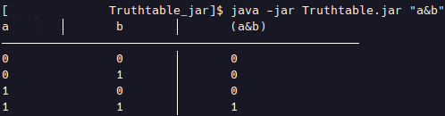

## Truthtable

is a program to get the truthtables of logical formulas <br/>
such as:

> conjunction: ```a&b```

> disjunction: ```a|b```

> subjunction: ```a>b```

> negation: ```!a```

You can chain those expressions together obviously

>Note: brackets always follow after a negation! <br/>
> If there are no brackets at all -> left to right is used

### Build

> `git clone https://github.com/gooosz/Truthtable.git`

and compile it using IntelliJ or other IDE's

#### Or

run from the command line
> `mvn clean install`

this builds a JAR file called `Truthtable.jar` <br/>
inside ```./out/artifacts/Truthtable_jar/```

### Run

To get actual output run
> ```java -jar truthtable.jar "expression"```

where ```truthtable.jar``` is the JAR and ```expression``` <br/>
the expression as a string in quotation marks

### Example

A truthtable for the expression ```a&b``` looks like this <br/>
